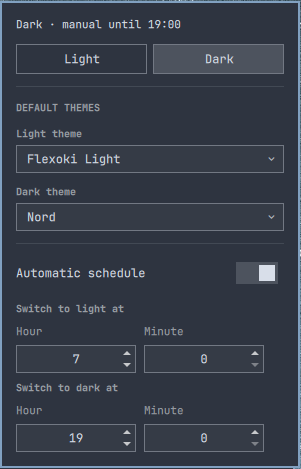

# Omamode

An Omarchy shell (Quickshell) plugin that keeps GNOME's light/dark preference
and your Omarchy theme in sync. Set a default theme for light mode and one
for dark mode; flip between them with two buttons, let GNOME's own setting
drive it, or put it on a daily schedule — either way, your Omarchy theme
follows automatically.

- **Manual switch** — Light/Dark buttons in the bar dropdown.
- **Follows GNOME** — if `org.gnome.desktop.interface color-scheme` changes
  from anywhere else (GNOME Settings, another script), the Omarchy theme
  switches to match.
- **Scheduled** — optional daily light/dark times; a manual switch while the
  schedule is on overrides it only until the next scheduled boundary, then
  the schedule resumes.



## Installation

```
omarchy plugin add https://github.com/andrewmsboyd/omamode.git --enable
```

This adds the widget to your bar's right section. Move it with:

```
omarchy bar move io.github.andrewmsboyd.omamode --section right
```

## Usage

Click the dimmer-switch icon in the bar to open the dropdown:

1. **Light / Dark buttons** — switch immediately.
2. **Light theme / Dark theme** — pick the Omarchy theme each mode should
   apply (any theme `omarchy theme list` shows).
3. **Automatic schedule** — toggle on, then set the hour/minute each mode
   should start.

The status line at the top of the dropdown shows the current mode and either
"following schedule" or how long a manual override has left before the
schedule resumes.

### CLI / keybinding access

```
omarchy-shell omamode status   # {"mode":"light","scheduleEnabled":true,"overrideActive":false}
omarchy-shell omamode light    # switch to light
omarchy-shell omamode dark     # switch to dark
omarchy-shell omamode toggle   # flip mode
```

Useful for wiring a Hyprland keybinding if you don't want to open the dropdown.

## Configuration

All configuration is stored inline in the widget's own entry in
`~/.config/omarchy/shell.json` (the same mechanism Omarchy's built-in widgets
use for their settings) — there's no separate config file. Everything is
editable from the dropdown; the underlying keys are `lightTheme`, `darkTheme`,
`scheduleEnabled`, `scheduleLightTime`, `scheduleDarkTime`.

## How it works / dependencies

- Runs entirely inside the existing `omarchy-shell` process — like every
  Omarchy shell plugin, it is **not sandboxed** and runs with your user
  permissions. It does not start a second Quickshell process, install a
  systemd service, or require any daemon of its own.
- Requires the `gsettings` binary (part of `glib2`) and the `omarchy` CLI,
  both already present on a standard Omarchy install. No packages are
  installed by this plugin.
- Two background processes are owned by the plugin's own service for as long
  as `omarchy-shell` runs: a `gsettings monitor` subprocess (detects external
  color-scheme changes) and a 60-second internal timer (evaluates the
  schedule). Both stop when the shell does; nothing persists outside it.
- The only commands it ever runs are `gsettings get/set/monitor
  org.gnome.desktop.interface color-scheme` and `omarchy theme
  list/current/set` — no `sudo`, no privilege escalation, no network access.

## Removal

```
omarchy plugin remove io.github.andrewmsboyd.omamode
```

## Attribution

The bulk of this plugin's design and implementation — architecture, Service/
BarWidget code, the icon-contrast fix, marketplace packaging — was written by
[Claude](https://claude.com/claude-code) (Anthropic), working interactively
with [@andrewmsboyd](https://github.com/andrewmsboyd), who directed the
design, tested it on real hardware, and reviewed/approved every change.
Noted here for transparency since GitHub's Contributors graph only credits
identities tied to a real linked account, which doesn't exist for an AI
assistant working locally.

## License

MIT — see [LICENSE](LICENSE).
